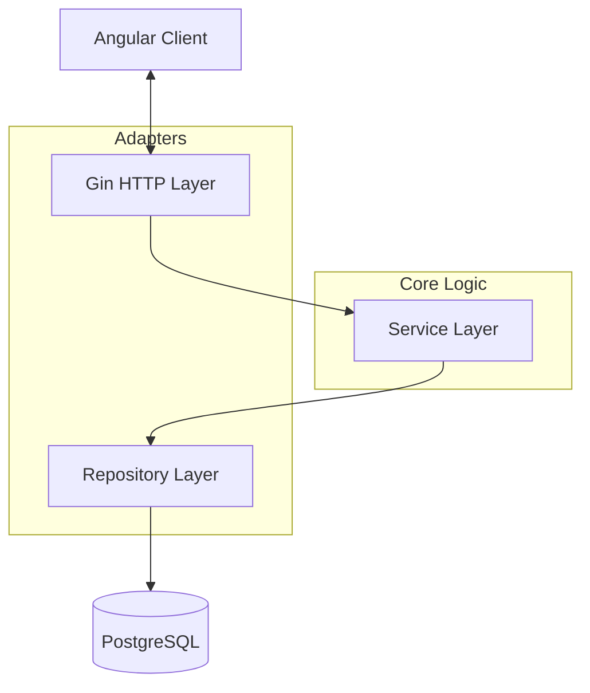

# Nexus Board (Trello Clone)


> **A modern, high-performance Kanban board application for professional project management.**


## 📌 Overview

Nexus is a robust, production-ready project management tool designed to replicate and extend the core functionality of Trello. Built with a **Clean Architecture** approach in Go and a reactive **Angular** frontend, it delivers real-time collaboration, comprehensive automation, and enterprise-grade security.

---

## 📸 Screenshots

| Dashboard | Board View (Kanban) |
|:---:|:---:|
|  |  |

| Card Detail | Automation Builder |
|:---:|:---:|
|  |  |

---

## 🚀 Features

### Core Functionality
- **Dynamic Workspaces**: Create unlimited boards and lists.
- **Drag & Drop**: Smooth, intuitive Kanban interface powered by Angular CDK.
- **Real-Time Sync**: Instant updates across all devices via WebSockets.
- **Responsive Design**: Fully optimized for Desktop, Tablet, and Mobile.

### Advanced Features (Tier 2 & 3)
- **🤖 Butler Automation**: Create natural-language rules (e.g., *"When a card is moved to Done, mark it as complete"*).
- **📋 Templates System**: Save boards and cards as templates for rapid setup.
- **🛠️ Custom Fields**: Define text, number, date, dropdown, and checkbox fields for your boards.
- **🏷️ Rich Metadata**: Labels, Checklists, Due Dates, and Attachments.
- **🔍 Advanced Search**: Filter boards and cards instantly.

### Engineering Excellence
- **Security Hardening**: Rate limiting, Secure Headers (HSTS/XSS), and input sanitization.
- **Performance**: Optimized DB indexing and lazy-loaded modules.
- **Architecture**: Modular "Hexagonal" architecture for maintainability.

---

## 🛠️ Tech Stack

### Backend
- **Language**: Go (Golang) 1.23+
- **Framework**: Gin Gonic (HTTP)
- **Database**: PostgreSQL (GORM ORM)
- **Real-time**: Gorilla WebSocket
- **Auth**: JWT (JSON Web Tokens)

### Frontend
- **Framework**: Angular 18+ (Standalone Components)
- **Styling**: Tailwind CSS
- **State Management**: Signals & RxJS
- **Icons**: Lucide Angular

### DevOps
- **Containerization**: Docker & Docker Compose
- **Reverse Proxy**: Nginx (Production)

---

## 🏗️ Architecture

Nexus follows a **Clean Architecture** (Hexagonal) pattern to ensure separation of concerns:



---

## 🚦 Getting Started

### Option 1: Docker (Recommended)

Get the full stack running in minutes.

```bash
# 1. Clone the repo
git clone https://github.com/yourusername/nexus-board.git
cd nexus-board

# 2. Start services
docker-compose up --build
```

Access the app at `http://localhost`.
Mail testing inbox (for notifications/marketing emails) is available at `http://localhost:8025`.

### Option 2: Manual Setup

**Backend**
```bash
cd personal-assessment
cp .env.example .env
# Edit .env with your DB credentials
go run cmd/server/main.go
```

**Frontend**
```bash
cd nexus-frontend
npm install
npm start
```

### Email Testing (Free, local)

To enable real SMTP delivery locally (without paid provider), run Mailpit:

```bash
docker run --rm -p 1025:1025 -p 8025:8025 axllent/mailpit:latest
```

Then ensure `.env` contains:

```env
SMTP_HOST=localhost
SMTP_PORT=1025
SMTP_FROM=no-reply@nexus.local
```

Open `http://localhost:8025` to view captured emails.

---

## 📜 License

This project is licensed under the MIT License - see the [LICENSE](LICENSE) file for details.
