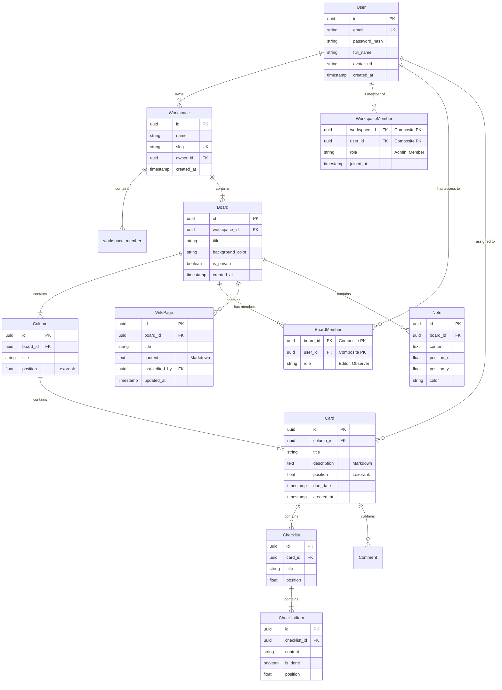

# Core Entity Relationship Diagram (ERD)
## Project Nexus v2.0 Schema

This document defines the core database schema for the Project Nexus platform, including new v2.0 entities for Documentation and Workspace Governance.

## Schema Notes
1.  **UUIDs**: All primary keys are UUID v4.
2.  **Scoping**: All queries MUST be scoped by `WorkspaceID` (via Board) for security.
3.  **Positioning**: `Checklist` and `ChecklistItem` use float-based positioning (Lexorank style) for efficient reordering.
4.  **Content**: `Card.description` and `WikiPage.content` store raw Markdown.
